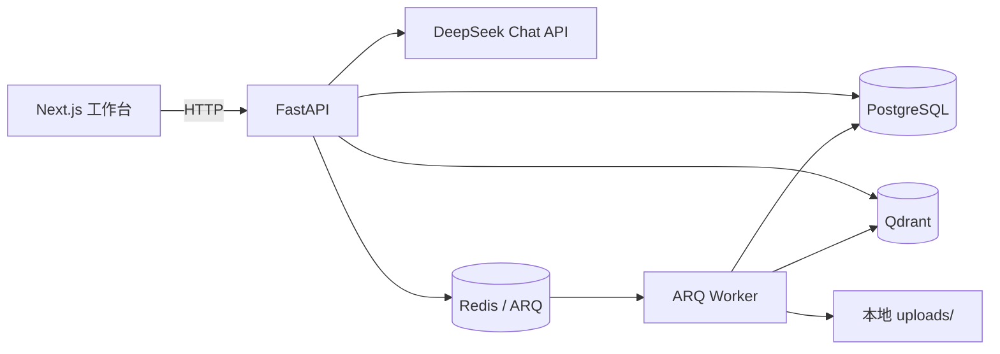

# Evidence RAG Platform

一个面向团队内部资料的可评测知识库问答平台。用户上传资料后，系统基于可追溯的证据回答问题；当证据不足时，明确拒答而不是编造答案。

## 项目目标

这是一个用于求职展示的全栈 AI 应用项目。重点不在“接入聊天模型”，而在于完成可解释检索、效果评测、工程化交付与成本/延迟取舍。

## MVP 范围

- 上传并解析 PDF、DOCX、Markdown 文件
- 异步分块、向量化并写入知识库
- 支持同一页面会话内的有限多轮追问，并在回答中展示来源片段
- 基于本地 BGE 语义向量与 BM25 的 RRF 混合检索生成上下文
- 无检索证据或模型返回非法引用时拒答
- 展示模型名称、端到端模型耗时与检索评测指标
- 使用 Docker Compose 本地启动 PostgreSQL、Redis、Qdrant

## 技术栈

| 层级 | 选择 |
| --- | --- |
| Web | Next.js、TypeScript、原生 CSS |
| API | Python、FastAPI、Pydantic、SQLAlchemy、Alembic |
| 数据 | PostgreSQL、Redis、Qdrant |
| 异步任务 | ARQ（Redis 队列） |
| AI | DeepSeek Chat API（OpenAI 兼容 SDK）、结构化引用输出 |
| 检索 | 本地 BGE 语义向量 + BM25 + RRF |
| 质量 | pytest、JSONL 评测集、知识库级评测案例 |
| 交付 | Docker Compose、uv、pnpm |

详细规格见 [docs/PRD.md](docs/PRD.md) 与 [docs/week-1-plan.md](docs/week-1-plan.md)。

## 当前架构



上传请求先保存源文件与文档记录，再通过 ARQ 异步解析、分块并写入 PostgreSQL/Qdrant。问答请求始终按知识库 ID 隔离检索；有命中时才调用模型，并校验模型返回的引用只能来自本次命中结果。

## 本地密钥配置

1. 将 `.env.example` 复制为项目根目录的 `.env`。
2. 在 `.env` 中填写新生成的 `DEEPSEEK_API_KEY`；不要将 `.env` 提交到 Git，也不要在聊天中发送密钥。
3. 后端通过 OpenAI 兼容 SDK 调用 `https://api.deepseek.com`；默认聊天模型为 `deepseek-v4-flash`。

## 基础设施（Docker Compose）

当前 Compose 负责启动 PostgreSQL、Redis 和 Qdrant；API、Web 和后续 Worker 仍在本地进程中运行。首次启动并等待健康检查：

```bash
docker compose up -d --wait
docker compose ps
```

停止基础设施但保留数据卷：

```bash
docker compose down
```

## 前端 RAG 工作台（当前里程碑）

`apps/web` 是一个 Next.js 知识库问答工作台：可创建/选择知识库、上传 Markdown/PDF/DOCX、轮询文档处理状态，并对失败任务重新入队；还能积累检索评测案例，并在指定知识库后调用 `POST /api/chat` 展示服务端校验过的来源片段。未选择知识库时，页面会明确标示为“直接模型调用”，不会模拟来源证据。

```bash
# Terminal 1: start the API
cd apps/api
uv run python -m uvicorn app.main:app --reload --port 8000

# Terminal 2: start the web app
cd apps/web
cp .env.local.example .env.local
pnpm install
pnpm dev
```

在浏览器打开 `http://localhost:3000`。前端只读取 `NEXT_PUBLIC_API_BASE_URL`；DeepSeek 密钥仍只允许放在项目根目录的 `.env`。

页面顶部会请求 `GET /health` 显示 API 已连接或未连接；它只表示 API 服务可达，不表示模型密钥已经配置成功。

## 当前数据与处理层里程碑

后端已定义 `KnowledgeBase`、`Document`、`DocumentChunk` 最小数据模型和 Alembic 初始迁移。当前仍是本地单用户模式。数据隔离与 PostgreSQL/Qdrant ID 规则见 [docs/data-model.md](docs/data-model.md)。

M2-A 已支持创建知识库与上传 Markdown/PDF/DOCX；M2-B 已接入 Redis/ARQ Worker，将文件解析、分块并写入 PostgreSQL/Qdrant，并可重试失败任务；M3 已提供按知识库隔离的本地向量 + BM25 + RRF 混合检索；M3-B 已实现服务端校验引用的证据问答契约、有限页面内追问上下文及前端知识库工作流；M4 已加入可复现的 JSONL 检索评测运行器和可管理的知识库级评测案例。处理过程、检索、问答和评测边界见 [docs/document-processing.md](docs/document-processing.md)、[docs/retrieval.md](docs/retrieval.md)、[docs/grounded-chat.md](docs/grounded-chat.md) 与 [docs/evaluation.md](docs/evaluation.md)。

### 自动化质量检查

仓库已配置 GitHub Actions CI：对 push 和 pull request 运行 API 的锁定依赖安装、pytest、Ruff，以及 Web 的锁定依赖安装、ESLint 和 production build。首次推送到 GitHub 后可在 Actions 页面查看实际运行记录。

### 尚未完成的关键能力

- 正式语义 Embedding 与同题集的效果、延迟、成本对比
- Reranker、基于可靠阈值的低置信度拒答
- 账户/权限、持久化会话、请求日志与答案反馈
- API/Web/Worker 的完整容器化

这些项目没有被计入已完成能力。BGE 已提供正式语义向量，但仍需用独立题集记录真实的检索效果、延迟与成本，不能在没有评测数据时宣称准确率。

最近一次本地真实链路验收记录见 [docs/verification.md](docs/verification.md)。
