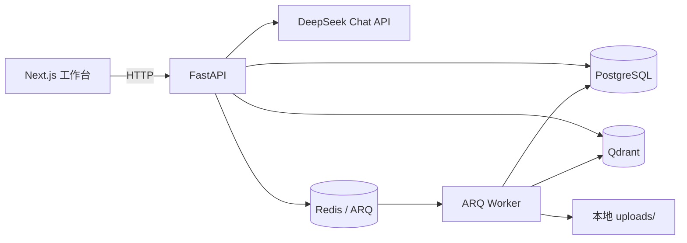

# Evidence RAG Platform

一个面向团队内部资料的可评测知识库问答平台。用户上传资料后，系统基于可追溯的证据回答问题；当证据不足时，明确拒答而不是编造答案。

## 项目目标

这是一个用于求职展示的全栈 AI 应用项目。重点不在“接入聊天模型”，而在于完成可解释检索、效果评测、工程化交付与成本/延迟取舍。

## MVP 范围

- 上传并解析 PDF、DOCX、Markdown 文件
- 异步分块、向量化并写入知识库
- 支持知识库内持久化会话、会话回看、回答反馈与 SSE 问答进度流
- 基于本地 BGE 语义向量、BM25、RRF 与 CrossEncoder 重排序生成上下文
- 无检索证据或模型返回非法引用时拒答
- 展示模型名称、端到端模型耗时与检索评测指标
- 使用 Docker Compose 本地启动 PostgreSQL、Redis、Qdrant

## 技术栈

| 层级 | 选择 |
| --- | --- |
| Web | Next.js、TypeScript、原生 CSS |
| API | Python、FastAPI、Pydantic、SQLAlchemy、Alembic |
| 数据 | PostgreSQL、Redis、Qdrant |
| 异步任务 | ARQ（Redis 队列） |
| AI | DeepSeek Chat API（OpenAI 兼容 SDK）、结构化引用输出 |
| 检索 | 本地 BGE 语义向量 + BM25 + RRF + CrossEncoder Reranker |
| 质量 | pytest、JSONL 评测集、知识库级评测案例 |
| 交付 | Docker Compose、uv、pnpm |

详细规格见 [docs/PRD.md](docs/PRD.md) 与 [docs/week-1-plan.md](docs/week-1-plan.md)。

## 当前架构



上传请求先保存源文件与文档记录，再通过 ARQ 异步解析、分块并写入 PostgreSQL/Qdrant。问答请求始终按知识库 ID 隔离检索；有命中时才调用模型，并校验模型返回的引用只能来自本次命中结果。

## 本地密钥配置

1. 将 `.env.example` 复制为项目根目录的 `.env`。
2. 在 `.env` 中填写新生成的 `DEEPSEEK_API_KEY`；不要将 `.env` 提交到 Git，也不要在聊天中发送密钥。
3. 后端通过 OpenAI 兼容 SDK 调用 `https://api.deepseek.com`；默认聊天模型为 `deepseek-v4-flash`。

## 基础设施（Docker Compose）

Compose 可一并启动 PostgreSQL、Redis、Qdrant、FastAPI、ARQ Worker 和 Next.js 工作台。根目录 `.env` 只在运行时注入 API/Worker，**不会**被复制进镜像。首次构建和启动并等待健康检查：

```bash
docker compose up --build -d --wait
docker compose ps
```

浏览器打开 `http://localhost:3000`，API 健康检查为 `http://localhost:8000/health`。查看服务日志：

```bash
docker compose logs -f api worker web
```

首次处理文档或检索时，API/Worker 容器会下载本地 BGE 模型；这是本地模型依赖的正常初始化，不是 DeepSeek 调用。模型缓存保存在 `model_cache` Docker 卷中，容器重建后可复用。

停止基础设施但保留数据卷：

```bash
docker compose down
```

## 前端 RAG 工作台（当前里程碑）

`apps/web` 是一个 Next.js 知识库问答工作台：可创建/选择知识库、上传 Markdown/PDF/DOCX、轮询文档处理状态，并对失败任务重新入队；还能积累检索评测案例，并在指定知识库后通过 `POST /api/chat/stream` 消费 SSE 状态和最终的服务端校验回答。页面支持打开同一知识库的历史会话，并可对持久化回答点赞或踩。未选择知识库时，页面会明确标示为“直接模型调用”，不会模拟来源证据。

```bash
# Terminal 1: start the API
cd apps/api
uv run python -m uvicorn app.main:app --reload --port 8000

# Terminal 2: start the web app
cd apps/web
cp .env.local.example .env.local
pnpm install
pnpm dev
```

在浏览器打开 `http://localhost:3000`。前端只读取 `NEXT_PUBLIC_API_BASE_URL`；DeepSeek 密钥仍只允许放在项目根目录的 `.env`。

页面顶部会请求 `GET /health` 显示 API 已连接或未连接；它只表示 API 服务可达，不表示模型密钥已经配置成功。

## 本地账户与资料隔离

工作台现在要求先注册或登录本地账户。密码使用服务端 scrypt 哈希保存；浏览器只保存可撤销的 Bearer 会话 token，API 按账户过滤知识库、文档、检索、评测与模型调用记录。

升级到包含账户迁移的版本后，**第一位注册用户**会一次性认领本机已有、尚无归属的旧知识库。这是为了保留升级前的本地资料；在共享机器上应由资料所有者先注册。后续账户彼此隔离，无法列出或访问其他账户的知识库。

这是本地单用户/小团队演示模式：尚未提供邮箱验证、找回密码、管理员管理或生产级身份提供商集成。

## 当前数据与处理层里程碑

后端已定义账户、会话、知识库、文档、文档分块、评测与模型调用数据模型，并通过 Alembic 管理迁移。数据隔离与 PostgreSQL/Qdrant ID 规则见 [docs/data-model.md](docs/data-model.md)。

M2-A 已支持创建、删除知识库与上传 Markdown/PDF/DOCX；删除知识库会清理 PostgreSQL 记录、Qdrant 向量和上传源文件；M2-B 已接入 Redis/ARQ Worker，将文件解析、分块并写入 PostgreSQL/Qdrant，并可重试失败任务；M3 已提供按知识库隔离的本地向量 + BM25 + RRF 混合检索；M3-B 已实现服务端校验引用的证据问答契约、服务端持久化的有限会话上下文及前端知识库工作流；M4 已加入可复现的 JSONL 检索评测运行器、可管理的知识库级评测案例，以及不产生模型调用的人工答案/引用评审记录。处理过程、检索、问答和评测边界见 [docs/document-processing.md](docs/document-processing.md)、[docs/retrieval.md](docs/retrieval.md)、[docs/grounded-chat.md](docs/grounded-chat.md)、[docs/conversations.md](docs/conversations.md) 与 [docs/evaluation.md](docs/evaluation.md)。

### 自动化质量检查

仓库已配置 GitHub Actions CI：对 push 和 pull request 运行 API 的锁定依赖安装、pytest、Ruff，以及 Web 的锁定依赖安装、ESLint 和 production build。首次推送到 GitHub 后可在 Actions 页面查看实际运行记录。

### 尚未完成的关键验收证据

- 采用短引用键的现存真实批次仍需完成新一轮逐题人工审核
- 浏览器端完整请求的端到端延迟记录
- 基于独立标注和固定环境校准的低置信度阈值
- 3–5 分钟的端到端演示视频

独立人工复核的 72 条 FastAPI 官方文档题集已完成正式检索评测：在 `top_k=3`、3 条预热的固定本机 Docker 环境下，RRF-only 的 Recall@3 为 `0.847`、MRR 为 `0.743`；启用 Reranker 后 Recall@3 保持 `0.847`、MRR 提升到 `0.819`，平均检索耗时由 `62.7 ms` 增至 `1390.0 ms`。完整的题集/审核/配置哈希与报告见 [docs/verification.md](docs/verification.md)。这些数字只反映文件级检索命中与排序，不能替代答案、引用、拒答、端到端延迟或成本结论。

旧 UUID 引用协议的固定 72 题批次已由 1 位评审者完成声明式逐题审核：49 条回答、21 条引用守卫拒答、2 条上游失败；答案 `47/49 (95.9%)`、引用 `45/49 (91.8%)`、拒答 `0/21 (0.0%)`。短引用键修复后另有一份现存可审计批次：56 条回答、16 条引用守卫拒答、无上游失败；72/72 次模型完成调用均有 token 与成本快照，按 2026-07-15 记录的 DeepSeek 缓存未命中价格保守估算总成本为 `0.127286 CNY`、平均每次模型完成 `0.00176786 CNY`。新批次尚未完成人工审核，因此这些 outcome 只能说明引用协议改善信号，不能写成新的答案、引用或拒答通过率。

最近一次本地真实链路验收记录见 [docs/verification.md](docs/verification.md)；按 PRD 逐项区分工程实现与正式效果证据的状态见 [docs/acceptance-audit.md](docs/acceptance-audit.md)。

录制正式 3–5 分钟演示时可按 [docs/demo-script.md](docs/demo-script.md) 执行；视频尚未录制时，不应把该脚本误写成已提供的演示视频。
